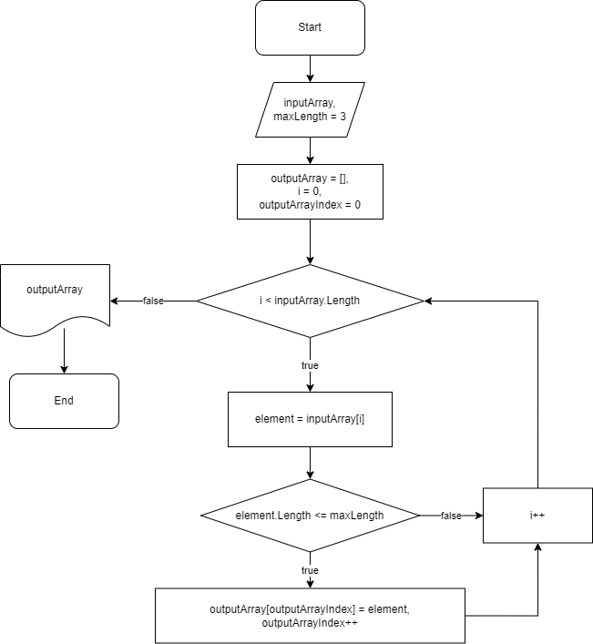

# FinalHomework2M

Программа на c# которая фильтрует строки в массиве по некоторой длине(если меньше этой длины).
Функция(метод) проходится в цикле по входному массиву и проверяет каждую строку, чтобы её длинав не была больше некоторого значения, по условию не больше 3. Если строка удовлетворяет условию, она добавляется в новый массив, который впоследствии будет вовращен функцией, как результат.
### Блок-схема основной функции filterByMaxLength

